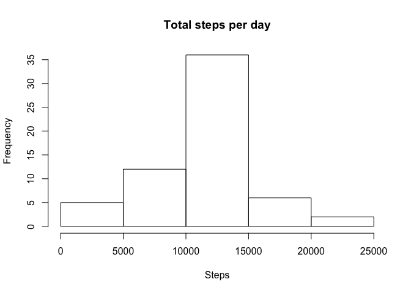

# Reproducible Research: Peer Assessment 1


## Loading and preprocessing the data
Firstly we need to load the dataset required for this assessment, and inspect the structure of the data


```r
activity <- read.csv(unz("activity.zip", "activity.csv"))
head(activity)
```

```
##   steps       date interval
## 1    NA 2012-10-01        0
## 2    NA 2012-10-01        5
## 3    NA 2012-10-01       10
## 4    NA 2012-10-01       15
## 5    NA 2012-10-01       20
## 6    NA 2012-10-01       25
```

```r
str(activity)
```

```
## 'data.frame':	17568 obs. of  3 variables:
##  $ steps   : int  NA NA NA NA NA NA NA NA NA NA ...
##  $ date    : Factor w/ 61 levels "2012-10-01","2012-10-02",..: 1 1 1 1 1 1 1 1 1 1 ...
##  $ interval: int  0 5 10 15 20 25 30 35 40 45 ...
```


## What is mean total number of steps taken per day?

We will calculate the total number of steps taken per day 

```r
library(dplyr)
```

```
## 
## Attaching package: 'dplyr'
```

```
## The following objects are masked from 'package:stats':
## 
##     filter, lag
```

```
## The following objects are masked from 'package:base':
## 
##     intersect, setdiff, setequal, union
```

```r
#summarise data by day and calculate sum of steps taken each day
TotSteps <- activity %>% group_by(date) %>% summarise(steps = sum(steps))
head(TotSteps)
```

```
## # A tibble: 6 × 2
##         date steps
##       <fctr> <int>
## 1 2012-10-01    NA
## 2 2012-10-02   126
## 3 2012-10-03 11352
## 4 2012-10-04 12116
## 5 2012-10-05 13294
## 6 2012-10-06 15420
```


Next we will create a histogram of the total number of steps taken each day

```r
hist(TotSteps$steps, main = "Total steps per day", xlab = "Steps")
```

<!-- -->


And now we will calculate and report the mean and median of the total number of steps taken per day. 

```r
MeanTotSteps <- mean(TotSteps$steps, na.rm = T)
MeanTotSteps
```

```
## [1] 10766.19
```

```r
MedTotSteps <- median(TotSteps$steps, na.rm = T)
MedTotSteps
```

```
## [1] 10765
```
The mean of the total number of steps taken per day is 1.0766189\times 10^{4} and the median is 10765.  


## What is the average daily activity pattern?
Firstly we will calculate the average number of steps taken per interval, averaged across all days.

```r
#summarise data by interval and calculate mean number of steps taken per interval
avgDailyPat <- activity %>% group_by(interval) %>% summarise(MeanSteps = mean(steps, na.rm=T))
head(avgDailyPat)
```

```
## # A tibble: 6 × 2
##   interval MeanSteps
##      <int>     <dbl>
## 1        0 1.7169811
## 2        5 0.3396226
## 3       10 0.1320755
## 4       15 0.1509434
## 5       20 0.0754717
## 6       25 2.0943396
```


Now we will create a time series plot of the 5-minute interval (x-axis) versus the average average number of steps taken, averaged across all days (y-axis).

```r
plot(avgDailyPat$interval, avgDailyPat$MeanSteps, type = "l",
     xlab = "Daily 5-minute intervals", 
     ylab = "Average steps",
     main = "Average Daily Activity Pattern")
```

<!-- -->


Which 5-minute interval, on average across all the days in the dataset, contains
the maximum number of steps?

```r
MaxStepsInterval <- avgDailyPat$interval[which.max(avgDailyPat$MeanSteps)]
MaxStepsInterval
```

```
## [1] 835
```
The 5-minute interval that contains the maximum number of steps is interval 835.


## Imputing missing values
To input missing values we first need to calculate and report on the total number of missing values. 

```r
Missing <- sum(is.na(activity$steps))
Missing
```

```
## [1] 2304
```
There are 2304 missing values.


We will now use the mean for the 5-minute intervals as a substitute for missing values. We will create a new dataset equal to the original dataset, however we will fill in the missing values. 

```r
#firstly merge the original dataset with the dataset of means for 5-min intervals
merge <- merge(activity, avgDailyPat, by = "interval")
#arrange by date and interval (personal preference)
merge <- merge %>% arrange(date, interval)
#create new variable called "NewSteps", if data is available from original dataset it will
#fill with those observations, otherwise it will fill with mean for 5-min interval
merge$NewSteps <- ifelse(!is.na(merge$steps), merge$steps, merge$MeanSteps)
head(merge)
```

```
##   interval steps       date MeanSteps  NewSteps
## 1        0    NA 2012-10-01 1.7169811 1.7169811
## 2        5    NA 2012-10-01 0.3396226 0.3396226
## 3       10    NA 2012-10-01 0.1320755 0.1320755
## 4       15    NA 2012-10-01 0.1509434 0.1509434
## 5       20    NA 2012-10-01 0.0754717 0.0754717
## 6       25    NA 2012-10-01 2.0943396 2.0943396
```

```r
#select necessary columns
NewActivity <- merge %>% select(NewSteps, date, interval)
head(NewActivity)
```

```
##    NewSteps       date interval
## 1 1.7169811 2012-10-01        0
## 2 0.3396226 2012-10-01        5
## 3 0.1320755 2012-10-01       10
## 4 0.1509434 2012-10-01       15
## 5 0.0754717 2012-10-01       20
## 6 2.0943396 2012-10-01       25
```


Now we will create a histogram of the total number of steps taken each day using this new data set and calculate and report on the mean and median total number of steps taken per day. 
To create our histogram we first need to summarise our data by date. 

```r
NewTotSteps <- NewActivity %>% group_by(date) %>% summarise(steps = sum(NewSteps))
head(NewTotSteps)
```

```
## # A tibble: 6 × 2
##         date    steps
##       <fctr>    <dbl>
## 1 2012-10-01 10766.19
## 2 2012-10-02   126.00
## 3 2012-10-03 11352.00
## 4 2012-10-04 12116.00
## 5 2012-10-05 13294.00
## 6 2012-10-06 15420.00
```


```r
hist(NewTotSteps$steps, main = "Total steps per day", xlab = "Steps")
```

<!-- -->


```r
NewMean <- mean(NewTotSteps$steps)
NewMean
```

```
## [1] 10766.19
```

```r
NewMed <- median(NewTotSteps$steps)
NewMed
```

```
## [1] 10766.19
```
Using the new data set with filled missing values, the mean of the total number of steps taken each day is 1.0766189\times 10^{4} and the median is 1.0766189\times 10^{4}. 


## Are there differences in activity patterns between weekdays and weekends?
To determine if there are differences in activity patterns between weekdays and weekends we will create a new factor variable in the dataset with two levels - “weekday” and 
“weekend” indicating whether a given date is a weekday or weekend day.

```r
#first create a new variable of weekday
NewActivity$Weekday <- weekdays(as.Date(NewActivity$date))
#then create a new factor variable of day type using Weekday to determine if new variable is "Weedend" or "Weekday"
NewActivity$DayType <- as.factor(ifelse(NewActivity$Weekday == c("Saturday", "Sunday"), "Weekend", "Weekday"))
```


Now we will create a panel plot containing a time series plot of the 5-minute interval (x-axis) and the average number of steps taken, averaged across all weekday days or weekend days (y-axis). 
To do this we first need to summarise our data by weekday/weekend and interval.

```r
avgDailyPat2 <- NewActivity %>% group_by(DayType, interval) %>% summarise(MeanSteps = mean(NewSteps))
head(avgDailyPat2)
```

```
## Source: local data frame [6 x 3]
## Groups: DayType [1]
## 
##   DayType interval  MeanSteps
##    <fctr>    <int>      <dbl>
## 1 Weekday        0 1.94375222
## 2 Weekday        5 0.38447846
## 3 Weekday       10 0.14951940
## 4 Weekday       15 0.17087932
## 5 Weekday       20 0.08543966
## 6 Weekday       25 1.38981844
```


```r
library(ggplot2)
daytype <- ggplot(avgDailyPat2, aes(interval, MeanSteps)) + geom_line() + 
        facet_wrap(~DayType, nrow = 2) + theme_bw() +
        labs(title = "Average Daily Activity Pattern by Weekday or Weekend") +
        labs(x="Daily 5-minute intervals", y = "Average steps")+
        theme(plot.title = element_text(hjust = 0.5))
daytype
```

<!-- -->


We can clearly see from the plot that there are differences in the activity patterns between weekdays and weekends. During weekdays the average activity starts earlier and there is a definitel spike in activity in the morning that peters off throughout the rest of the day, whereas the weekends show a more consistent level of activity throughout the day. 
